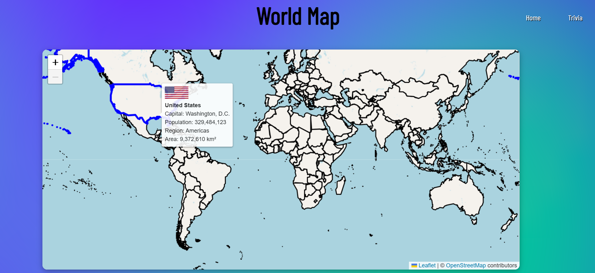
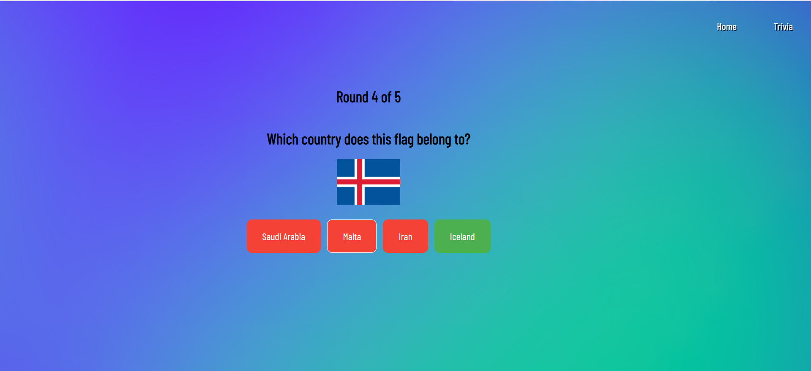

# 🌍 World Map & Flag Trivia App

An interactive web application built with React and Leaflet that displays a world map and challenges users with flag-based trivia. Learn country flags, names, and locations in a fun and engaging way!

## 🚀 Features

- 🗺️ **Interactive World Map** – Pan and zoom across a Leaflet-powered map with country hover effects and tooltips.
- 🧠 **Flag Trivia Game** – Guess which country corresponds to a given flag image.
- 🎯 **Multiple Rounds** – Choose from 5, 10, or 15 trivia rounds.
- 💡 **Instant Feedback** – Correct/incorrect options are color-coded after each guess.
- 🎨 **Stylish UI** – Clean and responsive design with custom fonts and background styling.

## 🛠️ Built With

- [React](https://reactjs.org/) – Frontend framework
- [React Router](https://reactrouter.com/) – For client-side routing
- [Leaflet](https://leafletjs.com/) – Interactive maps
- [React Leaflet](https://react-leaflet.js.org/) – React wrapper for Leaflet
- [REST Countries API](https://restcountries.com/) – For country data and flags

## Screenshots





## 📦 Installation

```bash
git clone https://github.com/the-maestro-star/world-map.git
cd world-map-app
npm install
npm run dev
```
## Screenshots


